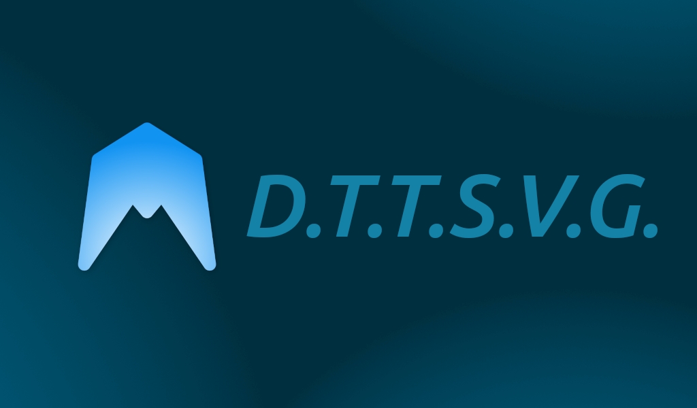

# DTTSVG - Domus Text To Speech Video Generator

DTTSVG est un module externe conçu pour **Home Assistant (Container)**. Il génère dynamiquement une vidéo d'onde sonore synchronisée avec votre flux Text-To-Speech (TTS) afin de l'afficher sur un écran connecté (comme le Google Nest Hub) via le protocole Cast.

---

## 📋 Prérequis
* Un serveur avec **Docker** et **Docker Compose** installés.
* **Home Assistant Container** fonctionnel.
* Un moteur TTS configuré sur Home Assistant (ex: `tts.piper`).

## 🚀 Installation & Configuration

### 1. Préparation des fichiers
Téléchargez ou clonez ce dépôt GitHub sur le serveur exécutant votre Home Assistant Container.

### 2. Configuration réseau (Docker)
Assurez-vous que les conteneurs de DTTSVG peuvent communiquer avec Home Assistant. Si vous utilisez des réseaux Docker spécifiques, modifiez le fichier `docker-compose.yml` pour inclure DTTSVG dans le même réseau que votre instance HA.

### 3. Création du Token Home Assistant
DTTSVG a besoin d'un accès à l'API de Home Assistant pour récupérer les URL audio.
1. Dans Home Assistant, cliquez sur votre **Profil** (en bas à gauche).
2. Allez dans l'onglet **Sécurité**.
3. Tout en bas, dans la section **Jetons d'accès longue durée**, créez un jeton nommé "DTTSVG".
4. Copiez ce jeton (il ne sera affiché qu'une seule fois).

### 4. Configuration de `app.py`
Ouvrez le fichier `app.py` et modifiez la section `--- CONFIGURATION ---` avec vos informations :
* `HA_URL` : L'URL locale de votre Home Assistant (ex: `http://192.168.1.50:8123`).
* `HA_TOKEN` : Collez ici le jeton longue durée généré à l'étape précédente.
* `TTS_ENGINE` : Le nom de votre entité TTS (par défaut `tts.piper`).
* `PUBLIC_URL` : Remplacez `VOTRE_IP_LOCAL` par l'adresse IP du serveur exécutant DTTSVG (le port `3000` sert à héberger la vidéo finale).

---

## ⚙️ Intégration dans Home Assistant

### 1. Ajouter la commande REST
Ouvrez votre fichier `configuration.yaml` dans Home Assistant et ajoutez le bloc suivant. Pensez à remplacer `VOTRE_IP_LOCAL` par l'IP de la machine hébergeant DTTSVG (le port `1240` est utilisé par l'API de génération) :

```yaml
rest_command:
  generer_tts_video:
    url: "http://VOTRE_IP_LOCAL:1240/generate_tts_video"
    method: POST
    headers:
      content-type: "application/json"
    payload: '{"text": "{{ text }}"}'

```

Redémarrez Home Assistant pour appliquer cette configuration.

### 2. Lancer DTTSVG

Dans le dossier contenant `docker-compose.yml`, démarrez l'application avec la commande :

```bash
docker compose up -d

```

---

## 🎯 Utilisation (Script Home Assistant)

Pour utiliser le système, créez un nouveau script dans Home Assistant. Ce script va envoyer le texte à DTTSVG, attendre la génération, puis envoyer la vidéo générée sur votre Nest Hub.

Voici le code YAML à copier dans un nouveau script (remplacez `media_player.nest_hub` par le nom exact de votre entité écran) :

```yaml
alias: DTTSVG | Speak
icon: mdi:video-waveform
fields:
  texte_message:
    description: Texte à envoyer
    required: true
    selector:
      text: null
sequence:
  - action: media_player.volume_mute
    metadata: {}
    target:
      entity_id: media_player.NEST_HUB
    data:
      is_volume_muted: true
  - action: media_player.turn_on
    metadata: {}
    target:
      entity_id: media_player.NEST_HUB
    data: {}
  - delay:
      hours: 0
      minutes: 0
      seconds: 0
      milliseconds: 500
  - action: media_player.volume_mute
    metadata: {}
    target:
      entity_id: media_player.NEST_HUB
    data:
      is_volume_muted: false
  - if:
      - condition: sun
        after: sunset
    then:
      - action: media_player.volume_set
        metadata: {}
        target:
          entity_id: media_player.NEST_HUB
        data:
          volume_level: 0.2
    else:
      - action: media_player.volume_set
        metadata: {}
        target:
          entity_id: media_player.NEST_HUB
        data:
          volume_level: 0.5
  - action: rest_command.generer_tts_video
    data:
      text: "{{ texte_message }}"
  - delay: "00:00:01"
  - action: media_player.play_media
    target:
      entity_id: media_player.NEST_HUB
    data:
      media:
        media_content_id: http://YOUR_SERVER_IP:3000/tts_visual.mp4
        media_content_type: video/mp4
        metadata: {}
description: ""

```

**C'est prêt !** Vous pouvez maintenant tester votre installation en appelant ce script et en lui passant la variable `message : "Bonjour, je suis prêt !"` pour voir l'interface réagir.